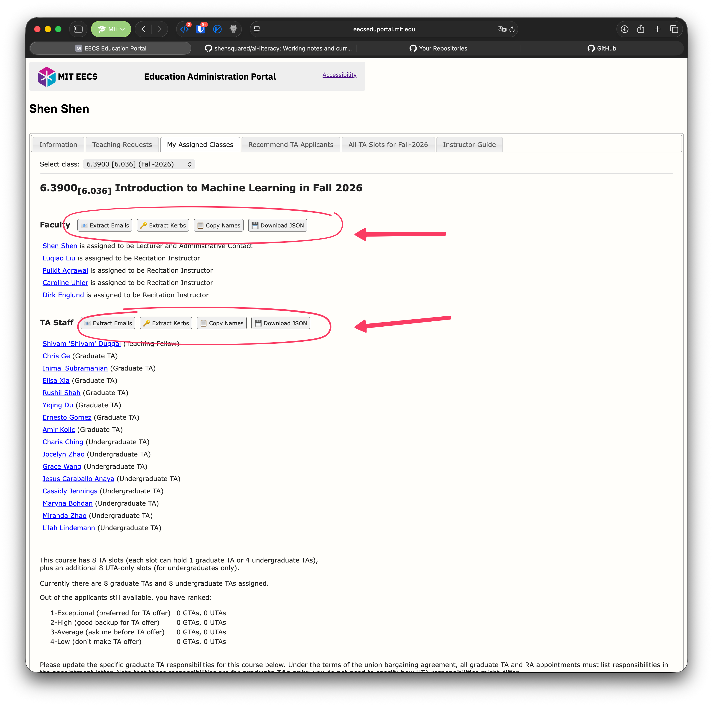

# MIT EECS Education Portal: userscripts

Userscripts that augment the [MIT EECS Education Administration Portal](https://eecseduportal.mit.edu) with extract / download buttons for Faculty and TA Staff rosters.

## What they do

The portal lists Faculty and TA Staff per class but offers no built-in way to copy the roster out. The userscripts in [userscripts/](userscripts/) inject buttons next to each section header:

- **Extract Emails**: emails to clipboard.
- **Extract Kerbs**: kerberos IDs to clipboard.
- **Copy Names**: full names list.
- **Download JSON**: structured roster file.

## Installing

1. Install [Tampermonkey](https://www.tampermonkey.net/).
2. Open one of the `.user.js` files; Tampermonkey will offer to install.
3. Reload an EECS Ed Portal page; buttons appear next to the Faculty / TA Staff headers.

## Scripts

- **`extract-faculty-ta-rosters.user.js`**: adds the buttons above on a class's portal page.
- **`la-grader-roster.user.js`**: adds Download Names / Download Kerbs buttons (plus an accepted-student count) on the LA / Grader page.

## Hiring

TA, LA, and Grader hiring runs through Eduportal: instructors mark TA preferences and class staff send LA / Grader offers at [`/eduportal/lects/#my-assigned-classes`](https://eecseduportal.mit.edu/eduportal/lects/#my-assigned-classes). TA assignments are coordinated by the EECS Education Office; LA / Grader offers are class-side.
